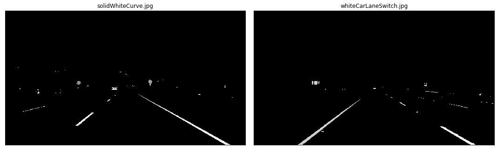

# **Finding Lane Lines on the Road**

Identifying lanes on the road is a common task performed by all human drivers to ensure their vehicles are within lane constraints when driving, so as to make sure traffic is smooth and minimize chances of collisions with other cars due to lane misalignment.

# Setup

Sample images of 960 x 540 pixels. Below are two of the provided images.

# The Pipeline

* Convert original image to HSL
* Isolate yellow and white from HSL image
* Combine isolated HSL with original image
* Convert image to grayscale for easier manipulation
* Apply Gaussian Blur to smoothen edges
* Apply Canny Edge Detection on smoothed gray image
* Trace Region Of Interest and discard all other lines identified by our previous step that are outside this region
* Perform a Hough Transform to find lanes within our region of interest and trace them in red
* Separate left and right lanes
* Interpolate line gradients to create two smooth lines

The input to each step is the output of the previous step (e.g. we apply Hough Transform to region segmented image).

## Convert To Different Color Spaces

The image below shows the original image next to its HSV and HSL equivalents

## Isolating Yellow And White From HSL Image

We first isolate yellow and white from the original image. After doing so, we can observe how the yellow and the white of the lanes are very well isolated.

Let's now combine those two masks using an OR operation and then combine with the original image using an AND operation to only retain the intersecting elements.

The results are very satisfying so far. See how the yellow road signs are clearly identified thanks to our HSL yellow mask! Next we move to grayscaling the image.

## Convert To Grayscale

## Gaussian Blur

## Canny Edge Detection

We show the smoothened grayscale and canny images together below:

## Region Of Interest

Our next step is to determine a region of interest and discard any lines outside of this polygon. One crucial assumption in this task is that the camera remains in the sample place across all these image, and lanes are flat, therefore we can identify the critical region we are interested in.

We put the canny and segmented images side by side and observed how only the most relevant details have been conserved:

## Hough Transform

The next step is to apply the [Hough Transform](https://en.wikipedia.org/wiki/Hough_transform) technique to extract lines and color them. The goal of Hough Transform is to find lines by identifiying all points that lie on them. This is done by converting our current system denoted by axis (x,y) to a _parametric_ one where axes are (m, b). In this plane:
 * lines are represented as points
 * points are presented as lines (since they can be on many lines in traditional coordinate system)
 * intersecting lines means the same point is on multiple lines

Therefore, in such plane, we can more easily identify lines that go via the same point. We however need to move from the current system to a _Hough Space_ which uses _polar coordinates_ one as our original expression is not differentiable when m=0 (i.e. vertical lines). In polar coordinates, a given line will now be expressed as (ρ, θ), where line L is reachable by going a distance ρ at angle θ from the origin, thus meeting the perpendicular L; that is ρ = x cos θ + y sin θ.
All straight lines going through a given point will correspond to a sinusoidal curve in the (ρ, θ) plane. Therefore, a set of points on the same straight line in Cartesian space will yield sinusoids that cross at the point (ρ, θ). This naturally means that the problem of detecting points on a line in cartesian space is reduced to finding intersecting sinusoids in Hough space.

The Hough transform returns lines, and the below images show what they look like:

## Separating Left And Right lanes

To be able to trace a full line and connect lane markings on the image, we must be able to distinguish left from right lanes. Fortunately, there is a trivial way to do so. If you carefully look the image (may be easier with the canny segmented images), you can derive the gradient (i.e slope) of any left or right lane line:
* left lane: **as x value (i.e. width) increases, y value (i.e. height) decreases: slope must thus be negative**
* right lane:**as x value (i.e. width) increases, y value (i.e. height) increases: slope must thus be positive**

We can therefore define a function that separates lines into a left and right one. We must be careful when the denominator of the gradient (the _dx_ in _dy/dx_) is 0, and ignore any line with such gradients.

In the below images, we color identified lines belonging to the left lane in red, while those belonging to the right lane are in blue:

# Videos

## Setup

Three videos were also provided to run our pipeline against them:
* a 10 seconds video with only white lane lines
* a 27 seconds video with a continuous yellow lane line on the left and dotted white lane line on right
* a _challenge_ video where the road is slightly curve and the resolution frames is higher

## First implementation

The initial implementation worked passably on the first two videos but utterly failed on the challenge exercise. To make the line detection smoother and take advantage in the sequencing and locality of each frame (and therefore lines), I decided to interpolate lane gradients and intercepts _across frames_, and discard any line that deviated too much from the computed mean from previous frames.

